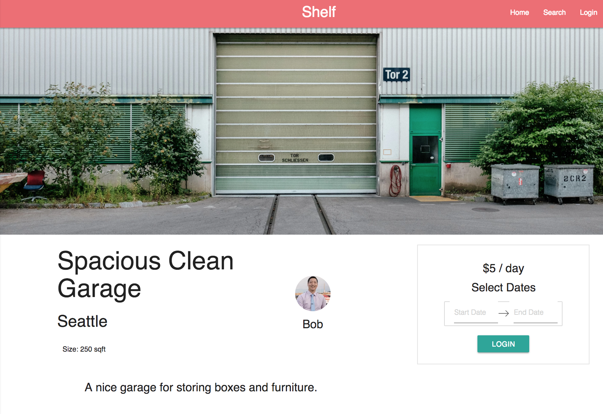

# Shelf Storage (Frontend)

This is the frontend of the project.
The backend repo can be found at: https://github.com/bryankai/shelf-storage-backend

*Shelf* is a community storage sharing platform that connects users with hosts to find affordable short-term storage in the community.  

### Guests
Have stuff to store?  In-between moves?  Studying abroad?  
* Search for local storage spaces near you
* Reserve a space for your specified dates
* Move in your belongings in to the storage space  

### Hosts
Have extra storage space?  Need some extra revenue?
* Create a listing for your space
* Select your price and availability
* Manage the reservations for your spaces

## Getting Started

These instructions will get you a copy of the project up and running on your local machine for development and testing purposes. See deployment for notes on how to deploy the project on a live system.


### Setting Up
In order to get your Shelf app up in development mode, you need to do a few steps:

* Fork and clone this repository
* Install npm packages

```shell
npm install
```

Make sure the database and backend are created first!

* Start the react development server:

```shell
npm start
```


## Deployment

This project has been deployed on Heroku at the address:
https://shelf-storage.herokuapp.com/

Search Results - Google Places API autocomplete dropdown bar


Individual Space Page


Dynamic Date Selection


Guest: Manage Orders


Host: Manage Spaces


Host: Manage Orders for each Space


## Built With

* [JavaScript](https://www.javascript.com/) - The language
* [React](https://reactjs.org/) - Frontend library
* [Redux](https://redux.js.org/) - State container
* [React Router](https://reacttraining.com/react-router/) - React library for dynamic routing
* [React-Materialize](https://reactstrap.github.io/) - React library using the Materialize front-end framework
* [Axios](https://github.com/axios/axios) - Promise based HTTP client for the browser and Node.js
* [Node.js](https://nodejs.org/en/) - Package ecosystem
* [Express.js](https://expressjs.com/) - Node.js web application framework
* [Knex.js](https://knexjs.org/) - SQL query builder
* [PostgreSQL](https://www.postgresql.org/) - SQL database
* [GoogleMapsAPI](https://developers.google.com/maps/documentation/javascript/) - Interactive maps
* [GooglePlacesAPI](https://developers.google.com/places/web-service/intro) - Places database for the dropdown autocomplete toolbar


## Contributing

Please send the developers a message for details on our code of conduct, and the process for submitting pull requests to us.


## Developers

**Bryan Kai** - *Initial work* - [github](https://github.com/bryankai) - [LinkedIn](https://www.linkedin.com/in/bryan-kai/)
